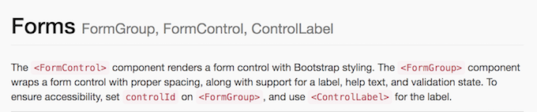
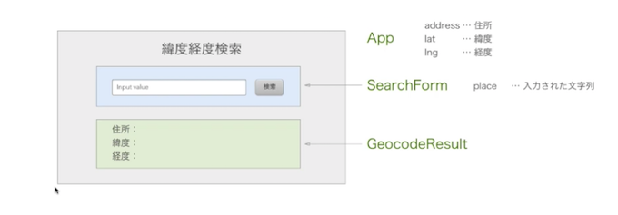

# create-react-appでReactの勉強
create-react-appを導入してReactの環境設定を行います。
面倒な設定など必要ありませんので、気軽にReact本来の組み立てに集中することができます。  
今回の手順はMacでおこなったものです。
* Node.jsがインストールされている必要があります。
* yarnがインストールされている必要があります。

## create-react-app導入
create-react-appを以下コマンドでグローバルでインストールします。
```
yarn global add create-react-app
```

## test作成
以下のコマンドを実行するとHomeの中にtestフォルダが作成されてcreate-react-app環境が構築されます。
```
create-react-app test
```
testフォルダに移動します。
```
cd test
```
サーバーを稼働させます。
```
yarn start
```
サーバー停止はctrl+C

## SASS導入
SASSを使いたいのでその環境を作ります。
```
yarn add node-sass-chokidar
```
```
yarn add npm-run-all
```
packege.jsonのscripts部分を以下のように記述します。
packege.json
```
{
  "name": "test",
  "version": "0.1.0",
  "private": true,
  "dependencies": {
    "node-sass-chokidar": "^1.3.0",
    "npm-run-all": "^4.1.3",
    "react": "^16.4.1",
    "react-dom": "^16.4.1",
    "react-scripts": "1.1.4"
  },
  "scripts": {
    "start-js": "react-scripts start",
    "start": "npm-run-all -p watch-css start-js",
    "build": "npm run build-css && react-scripts build",    "test": "react-scripts test --env=jsdom",
    "eject": "react-scripts eject",
    "build-css": "node-sass-chokidar src/ -o src/",
    "watch-css": "npm run build-css && node-sass-chokidar src/ -o src/ --watch --recursive"
  }
}

```

## コンポーネントの作成
## 独自boilerplate作成
### Classコンポーネントとfanctionalコンポーネント 
Classコンポーネントとfanctionalコンポーネントの違いはstateを持てるかどうかということです。Classコンポーネントがstateを保持することができます。
functionalコンポーネントはstateを持たないシンプルなコンポーネントを作成するときに使うと良いです。

#### functionalコンポーネントの例
```
import React from 'react';

const Hello = () => {
  return(
    <div>
      <h1>Hello!</h1>
      <p>functionalコンポーネントを作成した</p>
    </div>
  )
}
```

#### Classコンポーネントの例
```
import React, { Component } from 'react';

class App extends Component {
  render() {   
      <h1>Hello!</h1>
      <p>Classコンポーネントを作成した</p>
  }
}
```

#### props

propsで値を渡します。
```
import React from 'react';

const Hello = (props) => {
  return(
    <div>
      <h1>Hello!{props.name}</h1>
      <p>functionalコンポーネントを作成した</p>
    </div>
  )
}
```

#### propTypesを使った型チェック
旧バージョンからやり方が変更になっているの注意
```
import PropTypes from 'prop-types';
Hello.propTypes = {
  name: PropTypes.string
}
```

#### state
状態を維持する方法を確認します。
```
import React, { Component } from 'react';

class App extends Component {
    constructor(props){
		super(props)
		this.state = {name:"Haidoro"}
	}
  render() {   
      <h1>Hello!{this.state.name}</h1>
      <p>functionalコンポーネントを作成した</p>
  }
}
```

## React-Bootstrapの導入

Bootstrapの導入はcreate-react-app導入の際にできるReadmeを読めば手順が書かれています。

Bootstrapの追加手順

1. npmを使う方法  
npmからReact BootstrapとBootstrapをインストールします。
```
npm install --save react-bootstrap bootstrap@3
```
2. yarnを使う方法  
```
yarn add react-bootstrap bootstrap@3
```

src/index.jsファイルの先頭に下記をインポートする。
```
import 'bootstrap/dist/css/bootstrap.css';
import 'bootstrap/dist/css/bootstrap-theme.css';
```
src/App.jsファイルに下記をインポートする：
```
import { Navbar, Jumbotron, Button } from 'react-bootstrap';
```
これでBootstrapが使えるようになります。
なお、ReactでのBootstrapの使い方ドキュメントは以下を参考にします。なかなかGoodなものです。

[React-Bootstrap ドキュメント](https://react-bootstrap.github.io/getting-started/introduction)

### ボタンの追加

import文に以下を追加
```
import { Navbar, Jumbotron, Button } from 'react-bootstrap';
```
ボタンを追加したい場所に以下挿入
```
<Button bsStyle="primary">Primary</Button>
<Button bsStyle="danger">Danger</Button>
```

### コンポーネントを別ファイルに用意してそれをimport

Form.jsファイルを用意してフォームを作成。
[React-Bootstrap](https://react-bootstrap.github.io/components/alerts/)のComponentsのFormsを参考にして記述。（以下コード）
import文に`import { FormGroup, FormControl, ControlLabel,HelpBlock } from 'react-bootstrap';`を記述しないとエラーになるので注意。 
import文に必要なものは React-Bootstrapのドキュメントでそれぞれのパーツの見出し部分にグレーの色で記述されているのでそれを使う。  


また、最後の`render(<FormExample />);`はApp.jsで使用するのでこのファイルでは不要。  
その代わりにexportのために`export default FormExample;`を付け加える。

```
import React, { Component } from 'react';
import { FormGroup, FormControl, ControlLabel,HelpBlock } from 'react-bootstrap';


class FormExample extends Component {
  constructor(props, context) {
    super(props, context);

    this.handleChange = this.handleChange.bind(this);

    this.state = {
      value: ''
    };
  }

  getValidationState() {
    const length = this.state.value.length;
    if (length > 10) return 'success';
    else if (length > 5) return 'warning';
    else if (length > 0) return 'error';
    return null;
  }

  handleChange(e) {
    this.setState({ value: e.target.value });
  }

  render() {
    return (
      <form>
        <FormGroup
          controlId="formBasicText"
          validationState={this.getValidationState()}
        >
          <ControlLabel>Working example with validation</ControlLabel>
          <FormControl
            type="text"
            value={this.state.value}
            placeholder="Enter text"
            onChange={this.handleChange}
          />
          <FormControl.Feedback />
          <HelpBlock>Validation is based on string length.</HelpBlock>
        </FormGroup>
      </form>
    );
  }
}

export default FormExample;
```
## 経緯度検索サービス

経緯度検索サービスを使用するために次のプラグインを導入しておきます。

axiosの導入
```
yarn add axios
```
react-google-mapsの導入
```
 yarn add react-google-maps
```

今回作成するコンポーネントはAppコンポーネントとSearchFormと結果表示領域(GeocodeResult)になります。
stateは入力内容をplaceとしてSearchFormに持たせて、その結果のaddress,lat,lngはAppのステートとします。



## app.jsファイルの準備
App.jsファイルの準備をします。必要事項だけ記入して出力したい中身はまだ白紙の状態です。

```
import React, { Component } from 'react';

class App extends Component {
  constructor(props) {
    super(props);
    this.state = {

    };
  }

  render() {
    return (
      <div>
      </div>
    );
  }
}

export default App;

```

## search formの作成
まずはSearchFormから作成します。
ファイルSearchForm.jsxファイルを作成して次の記述を行います。

* jsx拡張子とjs拡張子はどちらも同じように使えます。
jsxにしておくと、AtomなどのエディッタでJSX記述でも￥emmet機能が使えたりします。（要設定）

SearchForm.jsx
```
import React, { Component, PropTypes } from 'react';
import PropTypes from 'prop-types';

class SearchForm extends Component {
  constructor(props) {
    super(props);
    this.state = {
      place: '東京駅', //空でも良い
    };
  }

  handlePlaceChange(place) {
    this.setState({ place });
  }

  handleSubmit(e) {
    e.preventDefault();
    this.props.onSubmit(this.state.place);
  }

  render() {
    return (
      <form onSubmit = {e => this.handleSubmit(e)}>
        <input
          type="text"
          value={this.state.place}
          onChange={e => this.handlePlaceChange(e.target.value)}
        />
        <input type="submit" value="検索" />
      </form>
    );
  }
}

SearchForm.proTypes = {
  onSubmit: PropTypes.func.isRequired,
};

export default SearchForm;

```

## searchフォームをブラウザで表示
SearchFormをブラウザで見れるようにするにはApp.jsに追加の記述を行います。

App.jsxファイルの記述
```
import React, { Component } from 'react';
import PropTypes from 'prop-types';
import SearchForm from './SearchForm';

class App extends Component {
  constructor(props) {
    super(props);
    this.state = {

    };
  }

  handlePlaceSubmit(place){
    console.log(place);
  }

  render() {
    return (
      <div>
        <h1>緯度経度検索</h1>
        <SearchForm onSubmit={place => this.handlePlaceSubmit(place)} />
      </div>
    );
  }
}

export default App;

```

ブラウザ（localhost:3000）で確認すると入力ボックスに「東京駅」と表示されています。submitボタンをクリックすると
コンソール画面で確認すると入力内容が確認されます。

## GeocodeResult部分作成

App.jsx
```
import React, { Component } from 'react';
import PropTypes from 'prop-types';
import SearchForm from './SearchForm';
import GeocodeResult from './GeocodeResult';

class App extends Component {
  constructor(props) {
    super(props);
    this.state = {

    };
  }

  handlePlaceSubmit(place){

  }

  render() {
    return (
      <div>
        <h1>緯度経度検索</h1>
        <SearchForm onSubmit={place => this.handlePlaceSubmit(place)} />
        <GeocodeResult address={this.state.address} lat={this.state.lat} lng={this.state.lng} />
      </div>
    );
  }
}

export default App;

```

GeocodeResult.jsx
```
import React, { PropTypes } from 'react';

const GeocodeResult = ({ address, lat, lng }) => (
  <ul className="geocode-result">
    <li>住所:{address}</li>
    <li>緯度:{lat}</li>
    <li>経度:{lng}</li>
  </ul>
);

GeocodeResult.PropTypes = {
  address: PropTypes.string,
  lat: PropTypes.number,
  lng: PropTypes.number,
};

GeocodeResult.defaultProps = {
  address: '',
  lat: 0,
  lng: 0,
};

export default GeocodeResult;

```

index.scss
```
$background-color: #eee;
$text-color:#444;
body{
  background-color: $background-color;
  text-align: center;
  color:$text-color;
}
.geocode-result{
  width:400px;
  margin: 0 auto;
  text-align:left;
}
```

## Mapの作成
public/index.htmlの`</body>`直前に次のコードを加えます。
本来自分のAPIコードが必要ですが、開発段階では無くてもOK
```
<script src="https://maps.googleapis.com/maps/api/js"></script>
```
続いてMap.jsファイルをsrcフォルダ内に作成
以下を記述

```
import React from 'react';
import {
  withGoogleMap,
  GoogleMap,
  Marker,
} from 'react-google-maps';

const InnerMap = withGoogleMap(props =>
  <GoogleMap
    defaultZoom={12}
    defaultCenter={{ lat: 35.6811673, lng: 139.7670516 }}
  >

  </GoogleMap>
);

const Map = props => (
  <InnerMap
  containerElement={<div style={{ height: `400px` }} />}
  mapElement={<div style={{ height: `100%` }} />}
  />
);
export default Map;
```

こちらの内容は
[react-google-maps](https://tomchentw.github.io/react-google-maps/#withgooglemap)のwithGoogleMap部分を参考にする。

App.jsでMapをimportします。
```
import Map from './Map';
```
## 検索結果の位置を表示


## デプロイ
デプロイしてGitHub Pagesに公開
[React-Bootstrap ドキュメント](https://react-bootstrap.github.io/getting-started/introduction)を参考にしてデプロイする。

まず、packege.jsonに以下を追加。`username`部分にはアカウント名を`my-app`部分にはリモートリポジトリ名を入れる。  
これが公開アドレスになります。
```
"homepage": "https://username.github.io/my-app",
```
GitHub Pagesに公開するためのプラグインを導入
```
yarn add gh-pages
```
続いてpackege.jsonに以下内容を追加
```
 "scripts": {
    "predeploy": "npm run build",
    "deploy": "gh-pages -d build",
    "start": "react-scripts start",
    "build": "react-scripts build",
```
デプロイの実行
```
 yarn run deploy
```
これでGitHub Pagesのアドレスに公開されています。
尚、GitHub Pagesの手動での設定はGitHubのSettingsタブを選択して「GitHub Pages」の所にあります。  
自動でgh-pages branchができているはずです。

今回の公開アドレスは以下  
[React Sample](https://haidoro.github.io/React_lesson4/)

なぜかSASSが動かなくなったのでpackege.jsonの記述を変更

```
{
  "name": "test",
  "version": "0.1.0",
  "private": true,
  "homepage": "https://haidoro.github.io/React_lesson4",
  "dependencies": {
    "axios": "^0.18.0",
    "bootstrap": "3",
    "gh-pages": "^1.2.0",
    "node-sass-chokidar": "^1.3.0",
    "npm-run-all": "^4.1.3",
    "prop-types": "^15.6.2",
    "react": "^16.4.1",
    "react-bootstrap": "^0.32.1",
    "react-dom": "^16.4.1",
    "react-google-maps": "^9.4.5",
    "react-scripts": "1.1.4"
  },
  "scripts": {
    "predeploy": "npm run build",
    "deploy": "gh-pages -d build",
    "start-js": "react-scripts start",
    "start": "npm-run-all -p watch-css start-js",
    "build-js": "react-scripts build",
    "build": "npm-run-all build-css build-js",
    "test": "react-scripts test --env=jsdom",
    "eject": "react-scripts eject",
    "build-css": "node-sass-chokidar src/ -o src/",
    "watch-css": "npm run build-css && node-sass-chokidar src/ -o src/ --watch --recursive"
  }
}

```
